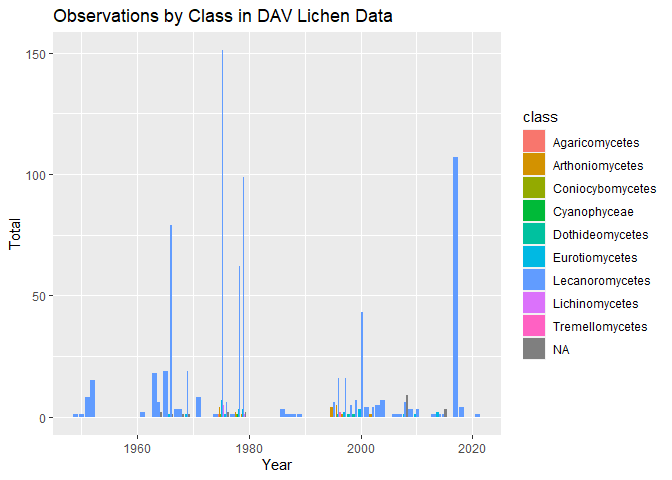
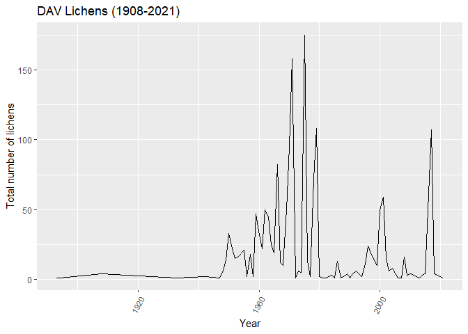

```r
#install.packages("tidyverse")
#install.packages("here")
#install.packages("janitor")
#install.packages("ggthemes")
#install.packages("RColorBrewer")
#install.packages("paletteer")
#install.packages("skimr")
#install.packages("nanitor")
```

```r
library(tidyverse)
```

```
## -- Attaching packages --------------------------------------- tidyverse 1.3.1 --
```

```
## v ggplot2 3.3.5     v purrr   0.3.4
## v tibble  3.1.6     v dplyr   1.0.8
## v tidyr   1.2.0     v stringr 1.4.0
## v readr   2.1.2     v forcats 0.5.1
```

```
## -- Conflicts ------------------------------------------ tidyverse_conflicts() --
## x dplyr::filter() masks stats::filter()
## x dplyr::lag()    masks stats::lag()
```

```r
library(here)
```

```
## here() starts at C:/Users/KAREN/Documents/DAV-Lichens
```

```r
library(janitor)
```

```
## 
##  次のパッケージを付け加えます: 'janitor'
```

```
##  以下のオブジェクトは 'package:stats' からマスクされています: 
## 
##      chisq.test, fisher.test
```

```r
library(ggthemes)
library(RColorBrewer)
library(paletteer)
library(skimr)
library(naniar)
```

```
## 
##  次のパッケージを付け加えます: 'naniar'
```

```
##  以下のオブジェクトは 'package:skimr' からマスクされています: 
## 
##      n_complete
```


```r
getwd()
```

```
## [1] "C:/Users/KAREN/Documents/DAV-Lichens"
```


```r
lichen_data <- read_csv(here("data", "occurrences.csv")) %>% clean_names()
```

```
## Warning: One or more parsing issues, see `problems()` for details
```

```
## Rows: 1628 Columns: 91
## -- Column specification --------------------------------------------------------
## Delimiter: ","
## chr  (49): institutionCode, collectionCode, basisOfRecord, occurrenceID, cat...
## dbl  (13): id, taxonID, year, month, day, startDayOfYear, localitySecurity, ...
## lgl  (28): ownerInstitutionCode, otherCatalogNumbers, taxonRemarks, typeStat...
## date  (1): eventDate
## 
## i Use `spec()` to retrieve the full column specification for this data.
## i Specify the column types or set `show_col_types = FALSE` to quiet this message.
```

```r
lichen_data
```

```
## # A tibble: 1,628 x 91
##         id institution_code collection_code owner_institution_c~ basis_of_record
##      <dbl> <chr>            <chr>           <lgl>                <chr>          
##  1 3314688 DAV              Lichens         NA                   PreservedSpeci~
##  2 3314689 DAV              Lichens         NA                   PreservedSpeci~
##  3 3314690 DAV              Lichens         NA                   PreservedSpeci~
##  4 3314691 DAV              Lichens         NA                   PreservedSpeci~
##  5 3314692 DAV              Lichens         NA                   PreservedSpeci~
##  6 3314693 DAV              Lichens         NA                   PreservedSpeci~
##  7 3314694 DAV              Lichens         NA                   PreservedSpeci~
##  8 3314695 DAV              Lichens         NA                   PreservedSpeci~
##  9 3314696 DAV              Lichens         NA                   PreservedSpeci~
## 10 3314697 DAV              Lichens         NA                   PreservedSpeci~
## # ... with 1,618 more rows, and 86 more variables: occurrence_id <chr>,
## #   catalog_number <chr>, other_catalog_numbers <lgl>,
## #   higher_classification <chr>, kingdom <chr>, phylum <chr>, class <chr>,
## #   order <chr>, family <chr>, scientific_name <chr>, taxon_id <dbl>,
## #   scientific_name_authorship <chr>, genus <chr>, subgenus <chr>,
## #   specific_epithet <chr>, verbatim_taxon_rank <chr>,
## #   infraspecific_epithet <chr>, taxon_rank <chr>, identified_by <chr>, ...
```

```r
lichens <- lichen_data %>% 
 select("class", "family", "scientific_name", "genus", "year", "country", "state_province", "county")
lichens
```

```
## # A tibble: 1,628 x 8
##    class        family scientific_name genus  year country state_province county
##    <chr>        <chr>  <chr>           <chr> <dbl> <chr>   <chr>          <chr> 
##  1 Lecanoromyc~ Colle~ Collema nigres~ Coll~  2017 United~ California     Napa  
##  2 Lecanoromyc~ Clado~ Cladonia squam~ Clad~  2017 USA     California     Napa  
##  3 Lecanoromyc~ Clado~ Cladonia squam~ Clad~  2017 USA     California     Napa  
##  4 Lecanoromyc~ Parme~ Evernia prunas~ Ever~  2017 USA     California     Napa  
##  5 Lecanoromyc~ Parme~ Evernia prunas~ Ever~  2017 USA     California     Napa  
##  6 Lecanoromyc~ Parme~ Flavoparmelia ~ Flav~  2017 USA     California     Napa  
##  7 Lecanoromyc~ Colle~ Collema nigres~ Coll~  2017 USA     California     Napa  
##  8 Lecanoromyc~ Parme~ Flavopunctelia~ Flav~  2017 USA     California     Napa  
##  9 Lecanoromyc~ Parme~ Flavopunctelia~ Flav~  2017 USA     California     Napa  
## 10 Lecanoromyc~ Parme~ Flavopunctelia~ Flav~  2017 USA     California     Napa  
## # ... with 1,618 more rows
```

```r
lichens %>% 
  filter(state_province=="California") %>% 
  group_by(year) %>% 
  summarize(n=n()) %>% 
  ggplot(aes(x=year, y=n))+
  geom_line()+
  theme(axis.text.x = element_text(angle= 60, hjust=1))+
  labs(title = "Number of DAV lichens collected in California",
       x="Year",
       y="Total number of lichens")
```

```
## Warning: Removed 1 row(s) containing missing values (geom_path).
```

<!-- -->

```r
lichens %>% 
  count(genus) %>% 
  arrange(desc(n))
```

```
## # A tibble: 194 x 2
##    genus           n
##    <chr>       <int>
##  1 Cladonia      104
##  2 <NA>          100
##  3 Ramalina       73
##  4 Usnea          64
##  5 Hypogymnia     50
##  6 Lecanora       49
##  7 Xanthoria      41
##  8 Parmelia       39
##  9 Umbilicaria    36
## 10 Lecidea        33
## # ... with 184 more rows
```

```r
lichens <- lichens %>% 
  na_if("Lichen") %>% 
  mutate(family=na_if(family, ("Lichen")))
lichens
```

```
## # A tibble: 1,628 x 8
##    class        family scientific_name genus  year country state_province county
##    <chr>        <chr>  <chr>           <chr> <dbl> <chr>   <chr>          <chr> 
##  1 Lecanoromyc~ Colle~ Collema nigres~ Coll~  2017 United~ California     Napa  
##  2 Lecanoromyc~ Clado~ Cladonia squam~ Clad~  2017 USA     California     Napa  
##  3 Lecanoromyc~ Clado~ Cladonia squam~ Clad~  2017 USA     California     Napa  
##  4 Lecanoromyc~ Parme~ Evernia prunas~ Ever~  2017 USA     California     Napa  
##  5 Lecanoromyc~ Parme~ Evernia prunas~ Ever~  2017 USA     California     Napa  
##  6 Lecanoromyc~ Parme~ Flavoparmelia ~ Flav~  2017 USA     California     Napa  
##  7 Lecanoromyc~ Colle~ Collema nigres~ Coll~  2017 USA     California     Napa  
##  8 Lecanoromyc~ Parme~ Flavopunctelia~ Flav~  2017 USA     California     Napa  
##  9 Lecanoromyc~ Parme~ Flavopunctelia~ Flav~  2017 USA     California     Napa  
## 10 Lecanoromyc~ Parme~ Flavopunctelia~ Flav~  2017 USA     California     Napa  
## # ... with 1,618 more rows
```

```r
naniar::miss_var_summary(lichens)
```

```
## # A tibble: 8 x 3
##   variable        n_miss pct_miss
##   <chr>            <int>    <dbl>
## 1 county             288   17.7  
## 2 state_province     275   16.9  
## 3 family             176   10.8  
## 4 genus              101    6.20 
## 5 class               83    5.10 
## 6 scientific_name     56    3.44 
## 7 year                34    2.09 
## 8 country             12    0.737
```

```r
lichens %>% 
  filter(state_province == "California") %>% 
  count(family) %>% 
  arrange(desc(n))
```

```
## # A tibble: 51 x 2
##    family              n
##    <chr>           <int>
##  1 Parmeliaceae      220
##  2 <NA>               76
##  3 Ramalinaceae       60
##  4 Teloschistaceae    59
##  5 Physciaceae        52
##  6 Lecanoraceae       45
##  7 Cladoniaceae       37
##  8 Collemataceae      29
##  9 Caliciaceae        26
## 10 Verrucariaceae     21
## # ... with 41 more rows
```


```r
lichens %>% 
  filter(state_province=="California") %>% 
  ggplot(aes(x= year, fill= family))+
  geom_bar(position="dodge")+
  coord_flip()+
  labs(title = "Observations by Family in DAV Lichen Data",
       x = "Year",
       y = "Total",
       fill = "Family")
```

```
## Warning: Removed 17 rows containing non-finite values (stat_count).
```

<!-- -->


```r
lichens %>% 
  filter(state_province=="California") %>% 
  ggplot(aes(x=year, y=family, fill= family))+
  geom_boxplot()
```

```
## Warning: Removed 17 rows containing non-finite values (stat_boxplot).
```

<!-- -->


```r
lichens %>% 
  filter(state_province=="California") %>% 
  ggplot(aes(x= year, fill= class))+
  geom_bar(position="dodge")+
  labs(title = "Observations by Class in DAV Lichen Data",
       x = "Year",
       y = "Total",
       fill = "class")
```

```
## Warning: Removed 17 rows containing non-finite values (stat_count).
```

<!-- -->

```r
lichens %>% 
  count(country) %>% 
  arrange(desc(n))
```

```
## # A tibble: 21 x 2
##    country            n
##    <chr>          <int>
##  1 United States   1185
##  2 New Zealand      115
##  3 United Kingdom   114
##  4 USA              100
##  5 Mexico            45
##  6 Canada            19
##  7 <NA>              12
##  8 Ecuador           11
##  9 Cayman Islands     6
## 10 Iceland            5
## # ... with 11 more rows
```

```r
lichens %>% 
  filter(state_province=="California") %>% 
  count(county) %>% 
  arrange(desc(n))
```

```
## # A tibble: 49 x 2
##    county              n
##    <chr>           <int>
##  1 Napa              113
##  2 Solano             83
##  3 Mendocino          82
##  4 Marin              64
##  5 Santa Barbara      48
##  6 San Mateo          46
##  7 Tehama             34
##  8 Butte              29
##  9 Alpine             26
## 10 San Luis Obispo    24
## # ... with 39 more rows
```


```r
lichens %>% 
  filter(state_province=="California") %>% 
  ggplot(aes(x= county, fill= county))+
  geom_bar(position="dodge")+
  labs(title = "Number of Lichens Collected from Different Counties in California",
       x = "County",
       y = "Number of Lichens")
```

<!-- -->


```r
berkeley_lichen <- read_csv(here("data", "occurrences_berkeley.csv")) %>% clean_names()
```

```
## Warning: One or more parsing issues, see `problems()` for details
```

```
## Rows: 55364 Columns: 91
## -- Column specification --------------------------------------------------------
## Delimiter: ","
## chr  (38): institutionCode, basisOfRecord, occurrenceID, catalogNumber, high...
## dbl  (12): id, taxonID, year, month, day, startDayOfYear, endDayOfYear, cult...
## lgl  (39): collectionCode, ownerInstitutionCode, otherCatalogNumbers, identi...
## dttm  (1): modified
## date  (1): eventDate
## 
## i Use `spec()` to retrieve the full column specification for this data.
## i Specify the column types or set `show_col_types = FALSE` to quiet this message.
```


```r
berkeley_lichen %>% 
  filter(state_province=="California") %>% 
  group_by(year) %>% 
  summarize(n=n()) %>% 
  ggplot(aes(x=year, y=n))+
  geom_line()+
  theme(axis.text.x = element_text(angle= 60, hjust=1))+
  labs(title = "Number of UC lichens collected in California",
       x="Year",
       y="Total number of lichens")
```

```
## Warning: Removed 1 row(s) containing missing values (geom_path).
```

<!-- -->

